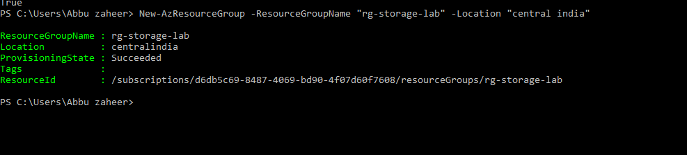
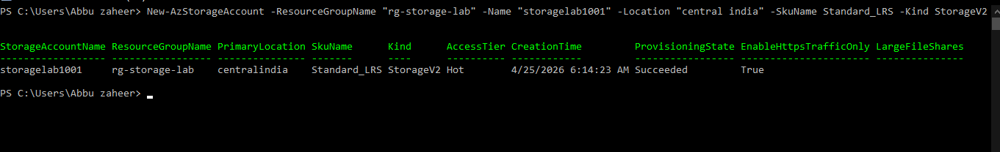
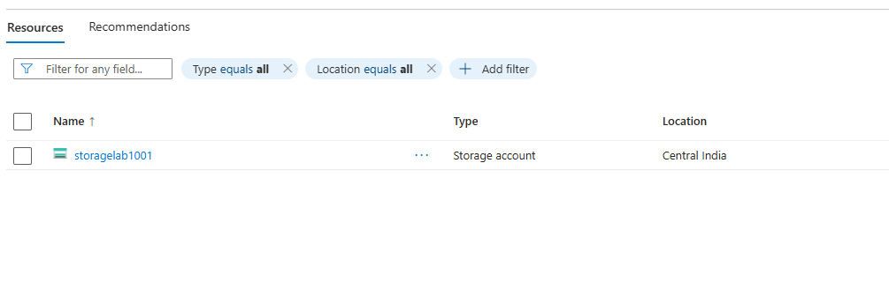
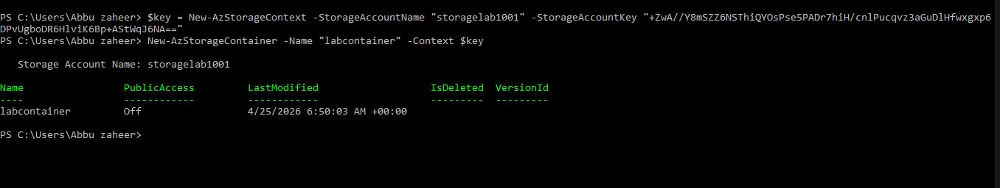
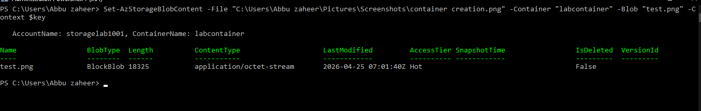
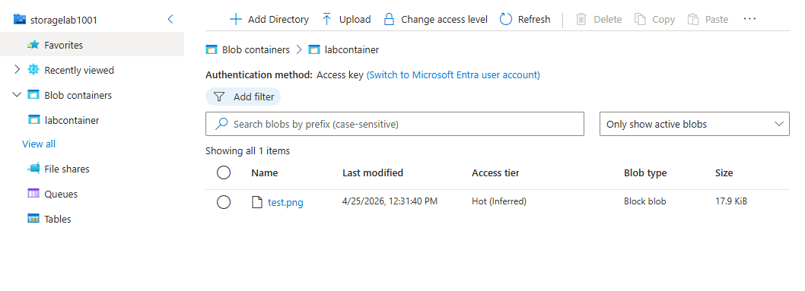

# Lab 2: Azure Storage Account

## 🎯 Objective
Provision and configure an Azure Storage Account using PowerShell, create containers, upload blobs, and verify access.

## ⚙️ Resources Deployed
- Resource Group: rg-storage-lab
- Storage Account: storagelab1001
- Container: labcontainer
- Blob: test.png

## 💰 Cost
FREE – No billable resources for basic usage

## 📸 Screenshots

**Resource Group Creation**  
The resource group `rg-storage-lab` was successfully created in Central India.  

**Storage Account Creation**  
A new storage account `storagelab1001` was provisioned with Standard_LRS in the same resource group.  

**Storage Account Listing**  
Listing confirms the storage account exists and is properly configured.  

**Container Creation**  
Created a container named `labcontainer` inside the storage account.  

**Blob Upload**  
Uploaded a test blob (`test.png`) into the container using PowerShell.  

**Blob List**  
Verified the blob is present by listing container contents.  

## 📚 Key Learnings
- How to provision and configure Azure Storage Accounts with PowerShell.
- How to generate and use access keys for secure connections.
- How to create containers and upload blobs programmatically.

## 📌 Resume Bullets
- Deployed and configured Azure Storage Account with PowerShell.
- Implemented secure access using storage keys and contexts.
- Created containers and uploaded blobs to demonstrate storage operations.
