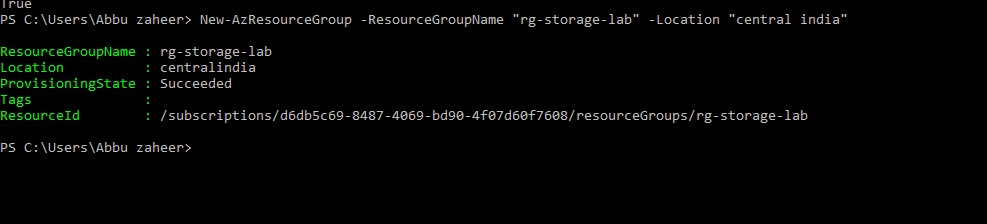
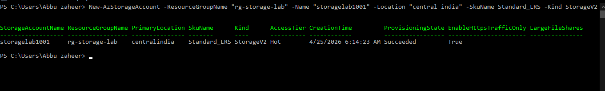
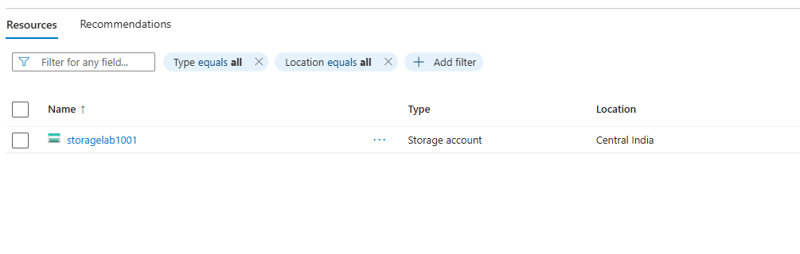
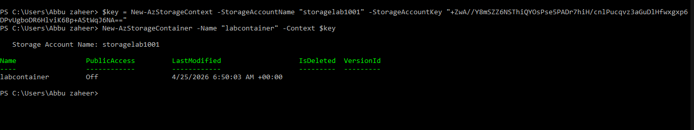
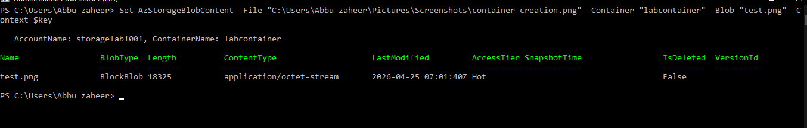
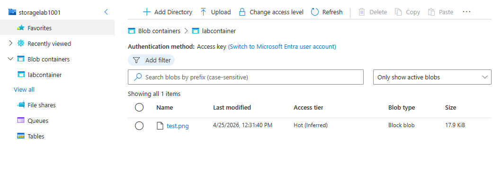

# Lab 2: Azure Storage Administration & Blob Management

## 🎯 Objective
Provision and configure Azure Storage resources using PowerShell by deploying a Storage Account, creating blob containers, uploading files, and validating secure storage access operations.

## ⚙️ Resources Deployed
- Resource Group: `rg-storage-lab`
- Storage Account: `storagelab1001`
- Storage Type: `StorageV2`
- Replication: `Standard_LRS`
- Blob Container: `labcontainer`
- Test Blob: `test.png`
- Management Tools:
  - Azure Portal
  - Azure PowerShell (Az Module)
 
## 🔐 Storage Configuration Overview
 
| Component | Configuration |
|---|---|
| Account Type | StorageV2 |
| Replication | Standard_LRS |
| Access Tier | Hot |
| Blob Access | Private Container |
| Deployment Method | Azure PowerShell |
| Validation Method | Azure Portal + PowerShell |

## 📸 Screenshots

### **Resource Group Deployment**  
Provisioned a dedicated Azure Resource Group using PowerShell for centralized storage resource management

### **Azure Storage Account Provisioning**  
Created a StorageV2 Azure Storage Account with locally redundant storage (LRS) replication using PowerShell.

### **Storage Resource Validation**  
Validated successful deployment and configuration of the Azure Storage Account through Azure Portal resource verification. 

### **Blob Container Configuration**  
Configured a private blob container within the Azrue Storage Account for structrued object storage operations. 

### **Blob Upload Operations**  
Uploaded and managed blob data within the container using Azure PowerShell storage management commands.

### **Storage Access Validation**  
Verified successful blob upload and container accessibility through Azure Portal blob inventory validation.

## ✅ Operational Validation
 
- Verified successful Storage Account deployment through Azure PowerShell and Azure Portal.
- Confirmed blob container creation and object upload operations.
- Validated secure storage access using storage account keys and storage contexts.
- Verified uploaded blob visibility and accessibility within the configured container.

## 📚 Key Learnings
- Provisioned and configured Azure Storage resources using Azure PowerShell.
- Understood Azure Storage Account types, replication methods, and access tiers.
- Gained hands-on experience managing blob containers and object uploads.
- Learned how Azure Storage authentication works using access keys and storage contexts.
- Validated Azure Storage resources through both Azure Portal and PowerShell-based verification.

## 📌 Resume Bullets
- Provisioned and configured Azure Storage Accounts using PowerShell with StorageV2 and LRS replication configuration.
- Managed blob storage operations including container creation, blob uploads, and storage validation workflows.
- Performed secure Azure Storage access configuration using storage keys and PowerShell storage contexts.
